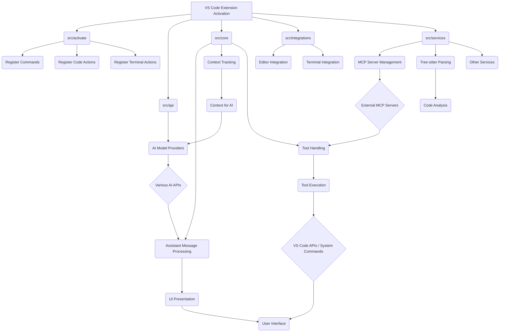
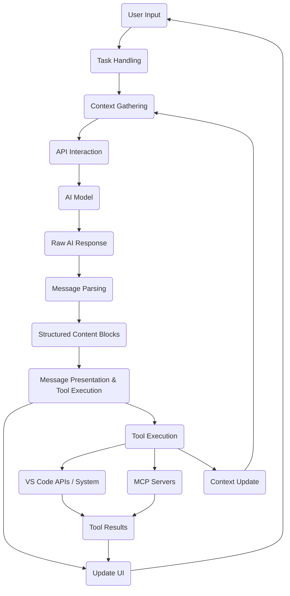

# Comprehensive Codebase Analysis Report

## Project Overview

This report provides a comprehensive analysis of the codebase, focusing on its architecture, key components, data flow, and extensibility mechanisms. The project appears to be a VS Code extension designed to facilitate interaction with AI models and external tools within the development environment.

## Architecture

The codebase follows a modular architecture, with distinct directories for different functionalities:

- **`src/activate/`**: Handles the activation of the VS Code extension and registration of commands, code actions, and terminal actions.
- **`src/api/`**: Manages interactions with various AI model providers.
- **`src/core/`**: Contains core logic for assistant message processing, context tracking, configuration, and tool handling.
- **`src/integrations/`**: Provides integrations with VS Code features like the editor and terminal.
- **`src/services/`**: Houses various services, including browser interaction, file listing, MCP server management, code search, telemetry, and Tree-sitter parsing.
- **`src/shared/`**: Contains shared types, constants, and utility functions used across the project.

A high-level conceptual diagram of the architecture could look like this:

## Key Modules and Functionality

### `src/extension.ts`

This is the main entry point of the extension. It is responsible for:

- Loading environment variables.
- Initializing core components like `ContextProxy`, `TelemetryService`, `TerminalRegistry`, and `McpServerManager`.
- Registering the `ClineProvider` for the webview UI.
- Registering various commands, code actions, and URI handlers.
- Setting up the diff view content provider.
- Implementing the `deactivate` function for cleanup.

This file essentially bootstraps the entire extension and sets up the necessary infrastructure.

### `src/activate/`

This directory contains modules related to the activation and initial setup of the extension's features within the VS Code environment.

- **`src/activate/index.ts`**: Simply re-exports functions from other files in the directory, providing a single point of import for activation-related functions.
- **`src/activate/CodeActionProvider.ts`**: Implements a `vscode.CodeActionProvider` to offer context-aware actions within the editor.
- **`src/activate/handleTask.ts`**: Likely handles the initiation of new tasks within the extension.
- **`src/activate/handleUri.ts`**: Processes URIs, potentially for deep linking or handling specific protocols.
- **`src/activate/humanRelay.ts`**: Seems to handle interactions related to a "human relay" mechanism, possibly for tasks requiring human intervention or feedback.
- **`src/activate/registerCodeActions.ts`**: Registers the code actions provided by the `CodeActionProvider`.
- **`src/activate/registerCommands.ts`**: Registers the various VS Code commands exposed by the extension.
- **`src/activate/registerTerminalActions.ts`**: Registers actions related to the integrated terminal.

This module is responsible for integrating the extension's functionalities seamlessly into the VS Code user interface and workflow.

### `src/api/`

This module is central to the extension's interaction with AI models.

- **`src/api/index.ts`**: Defines the `ApiHandler` interface and the `buildApiHandler` factory function. This function dynamically creates an instance of the appropriate API handler based on the configured AI provider (e.g., Anthropic, OpenAI, Gemini, Bedrock, etc.). It abstracts the specifics of each provider behind a common interface. It also includes logic for managing model parameters like `maxTokens` and `temperature`.
- **`src/api/providers/`**: Contains individual implementations of the `ApiHandler` interface for different AI providers. Each file in this directory (`anthropic.ts`, `openai.ts`, `gemini.ts`, etc.) is responsible for communicating with a specific AI API.
- **`src/api/transform/`**: Handles the transformation of data between the application's internal format and the formats required by different AI providers. This includes handling streaming responses and potentially caching.

This module provides a flexible and extensible way to integrate with a variety of AI models.

### `src/core/assistant-message/`

This module is responsible for processing messages received from the AI model.

- **`src/core/assistant-message/parseAssistantMessage.ts`**: Parses the raw string output from the AI model. It identifies text content and tool use blocks by looking for specific XML-like tags. It extracts tool names and parameters, structuring the message into an array of content blocks. This parsing is crucial for the application to understand the model's intent, especially when it requests tool execution.
- **`src/core/assistant-message/presentAssistantMessage.ts`**: Takes the structured content blocks from `parseAssistantMessage.ts` and presents them to the user in the webview. It renders text content and, importantly, executes the tools specified in the tool use blocks. This file orchestrates the interaction with the user, handles tool execution (including requesting user approval), manages errors, and tracks tool usage. It acts as the bridge between the AI's output and the application's actions.

This module forms the core of the conversation flow and tool execution pipeline.

### `src/core/context-tracking/`

This module is dedicated to managing the context of files within the user's workspace.

- **`src/core/context-tracking/FileContextTracker.ts`**: Tracks file changes using VS Code's file system watchers. It differentiates between user edits and edits made by Roo to maintain accurate context. It stores metadata about files (read/edit dates by user and Roo) in a task-specific file. This tracker is vital for ensuring that the AI model has access to up-to-date file content and for features like diff editing where knowing the current state of a file is critical.

This module ensures that the application maintains an awareness of the relevant files and their state in the user's project.

### `src/services/mcp/`

This module handles the integration with Model Context Protocol (MCP) servers.

- **`src/services/mcp/McpHub.ts`**: Manages connections to MCP servers configured in global settings and project-level `.roo/mcp.json` files. It supports stdio and SSE transport types. The `McpHub` is responsible for connecting to servers, fetching their available tools and resources, handling connection lifecycle, validating server configurations, and notifying the UI about server status changes. This module is key to extending Roo's capabilities by allowing it to interact with external services and tools.
- **`src/services/mcp/McpServerManager.ts`**: A static class that likely manages the lifecycle of the `McpHub` instance and provides a way for other parts of the application to access it.

This module enables the dynamic addition of capabilities to the extension through external MCP servers.

### `src/services/tree-sitter/`

This module integrates the Tree-sitter parsing library for code analysis.

- **`src/services/tree-sitter/index.ts`**: Provides functions to parse source code files and extract definitions (classes, functions, etc.) using Tree-sitter. It supports a wide range of languages and also handles markdown files. It builds an Abstract Syntax Tree (AST) and runs language-specific queries to identify definitions. It includes logic to filter results and respects `.rooignore` rules. This module is used by tools like `list_code_definition_names` to give the user (and potentially the AI) a high-level overview of the code's organization without needing to read the entire file content. This is particularly useful for large projects where a full file read might be inefficient or overwhelming. The support for a wide range of languages and the handling of `.rooignore` rules make this a versatile code analysis component.
- **`src/services/tree-sitter/languageParser.ts`**: Handles the loading and management of Tree-sitter language parsers.
- **`src/services/tree-sitter/markdownParser.ts`**: Provides specific parsing logic for markdown files.
- **`src/services/tree-sitter/queries/`**: Contains language-specific Tree-sitter queries used to extract definitions.

This module provides the capability to understand the structure of the code within the user's workspace.

## Data Flow

The data flow within the application can be summarized as follows:

1.  **User Input:** The user interacts with the webview UI, providing prompts or triggering actions.
2.  **Task Handling:** User input is processed, and a new task is potentially created or an existing one is updated.
3.  **Context Gathering:** The `FileContextTracker` and other mechanisms gather relevant context from the workspace (e.g., active files, file content).
4.  **API Interaction:** The `ApiHandler` (built by `src/api/index.ts`) sends the user's prompt and gathered context to the configured AI model.
5.  **AI Model Response:** The AI model processes the input and returns a response, which is a string containing text and potentially tool use directives in an XML-like format.
6.  **Message Parsing:** `src/core/assistant-message/parseAssistantMessage.ts` parses the raw AI response into structured content blocks (text and tool use).
7.  **Message Presentation and Tool Execution:** `src/core/assistant-message/presentAssistantMessage.ts` processes the content blocks:
    - Text blocks are displayed in the webview.
    - Tool use blocks trigger the execution of the corresponding tool function (e.g., `read_file`, `write_to_file`, `execute_command`, `use_mcp_tool`).
8.  **Tool Execution:** Tool functions interact with VS Code APIs, the file system, the terminal, or MCP servers to perform the requested actions. User approval may be required for certain actions.
9.  **Tool Results:** The results of tool execution are captured and formatted.
10. **UI Update:** The webview UI is updated with the assistant's text response, tool execution progress, and tool results.
11. **Context Update:** The `FileContextTracker` updates its state based on file modifications resulting from tool execution or user actions.
12. **Iteration:** The process repeats based on the AI's response (e.g., if the AI provides further instructions or tool uses) or the user's next input.

A simplified data flow diagram:

## Extensibility

The application is designed with extensibility in mind, primarily through:

- **AI Provider Abstraction:** The `src/api/` module allows easy integration of new AI models by implementing the `ApiHandler` interface. The `buildApiHandler` function provides a centralized way to manage different providers.
- **Model Context Protocol (MCP):** The `src/services/mcp/McpHub.ts` enables dynamic integration with external MCP servers. These servers can provide custom tools and resources, extending the application's capabilities beyond its built-in tools. This allows developers to create and connect their own services to interact with Roo.
- **Tool-Based Interaction:** The core interaction model is based on the AI using predefined tools. This structured approach makes it easier to add new tools and define how the AI can leverage them.

## Code Analysis with Tree-sitter

The integration of Tree-sitter in `src/services/tree-sitter/index.ts` provides a powerful capability for understanding the structure of the codebase. By parsing files into ASTs and running targeted queries, the application can extract meaningful information like function and class definitions. This is used by tools such as `list_code_definition_names` to give the user (and potentially the AI) a high-level overview of the code's organization without needing to read the entire file content. This is particularly useful for large projects where a full file read might be inefficient or overwhelming. The support for a wide range of languages and the handling of `.rooignore` rules make this a versatile code analysis component.

## Context Management

The `FileContextTracker` in `src/core/context-tracking/FileContextTracker.ts` plays a crucial role in maintaining the application's awareness of the user's workspace. By tracking file modifications, it helps prevent issues that could arise from working with outdated file content. This is especially important for operations that involve modifying existing files, such as applying diffs. The tracker's ability to distinguish between user and Roo edits ensures that context updates are triggered appropriately, contributing to a more robust and reliable interaction with the codebase.

## Conclusion

The codebase is a well-structured and modular application designed to integrate AI assistance into the VS Code development workflow. Its architecture emphasizes clear separation of concerns, with dedicated modules for activation, API interaction, message processing, context tracking, and external service integration via MCP. The use of Tree-sitter for code analysis and the robust file context tracking mechanism contribute to its ability to understand and interact with the user's codebase effectively. The extensibility points, particularly the MCP integration and the flexible API handling, allow for future growth and adaptation to new AI models and external tools.

This comprehensive analysis provides a foundation for understanding the application's design and functionality. Further deep dives into specific modules or features could provide even more detailed insights.
